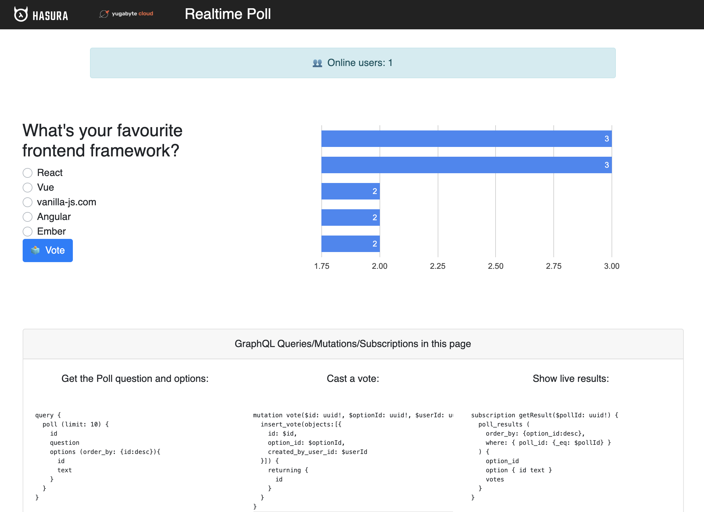

# GraphQL Workshop for getting started with Yugabyte Cloud

This repo provides instructions for Hands-on workshop for building GraphQL Applications with Hasura cloud instance configured with Yugabyte Cloud.

## Prerequisites

- Basic Understanding of GraphQL
- Basic familiarity with YugabyteDB fundamentals - https://docs.yugabyte.com/latest/explore/
- Basic familiarity with Hasura GraphQL Engine
- Basic experience with NodeJS programming
- IDE/Editor of choice - Sublime or IntelliJ or Visual Studio Code

## Technical Requirements

- Access to [Yugabyte Cloud Instance](https://www.yugabyte.com/cloud/)
- Access to [Hasura Cloud Instance](https://cloud.hasura.io/signup?pg=products&plcmt=body&cta=get-started-for-free&tech=default)
- Install [Hasura CLI](https://hasura.io/docs/latest/graphql/core/hasura-cli/install-hasura-cli.html)

## what we will build in this workshop?

The Realtime Poll application is built using React and is powered by Hasura
Cloud Instance over YugabyteDB Cloud. It has an interface for users to cast vote on a
poll and the results are updated in the on-screen bar chart, in real-time.

The application makes use of Hasura GraphQL Engine's real-time capabilities
using `subscription`. There is no backend code involved. The application will use 
Hasura Cloud + Yugabyte Cloud for running the GraphQL Queries.

## Agenda

- Overview of GraphQL Applications using Hasura and YugabyteDB
- Hands on session for Implementing a real-time poll application
  - Setup the Hasura + YugabyteDB cloud connectivity
  - Running migrations to setup schema for real-time poll application in YugabyteDB database
  - Updating nodejs application to use Hasura Cloud Instance
  - Running the real-poll application
- Tuning and performance of GraphQL Queries
- Do's and Don't for GraphQL queries with YugabyteDB

## Workshop Hands-on Session

Steps for running the hands-on session can be found [here](./workshop.md).

## Session Slides

Session slides can be found [here](./dss-yugabyte-hasura-cloud-workshop.pdf)